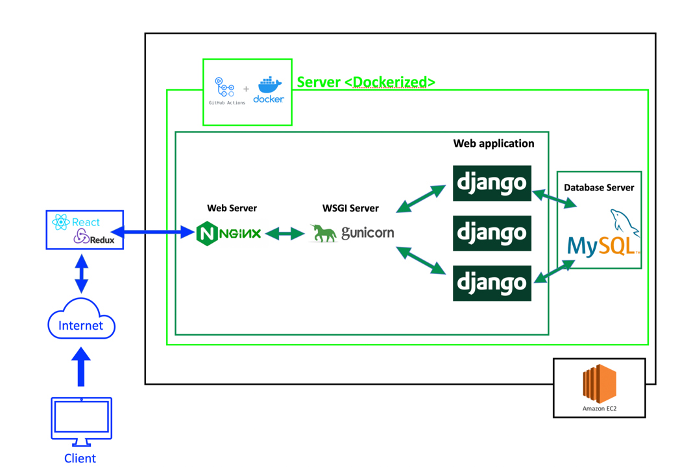
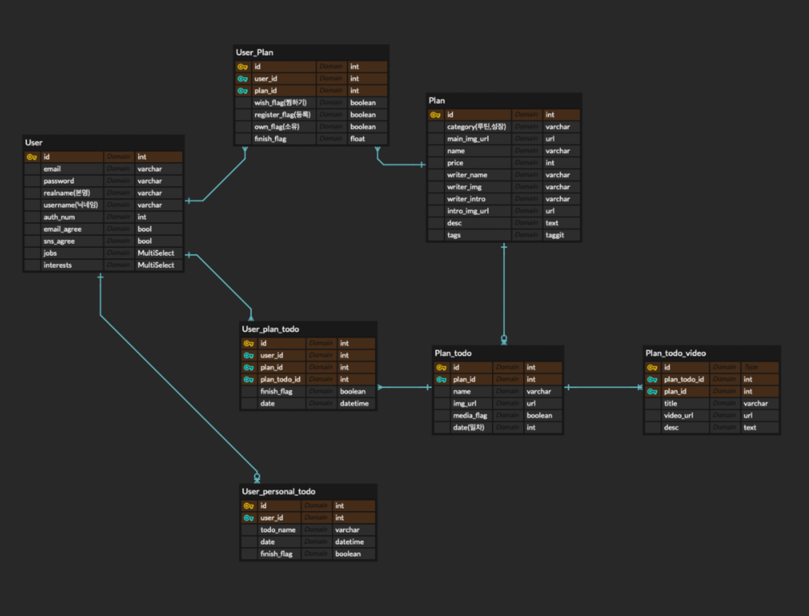

# 🪐 MyPlanIt_Back 🪐

## 🌘 팀원 소개
  
|  [서수경](https://github.com/sukyeongs)                            |  [이수진](https://github.com/ssssujini99)                            |
| ---------------------------------------------------------- | ---------------------------------------------------------- |
|  ****|  수진언니으 미모지 넣기 헤헤                 |
| [Setting] Django, EC2, RDS, Docker, Github Actions, S3 세팅<br />[Plan] 플랜 구매, 플랜 찜하기, 구매 플랜 조회, 찜한 플랜 조회<br />[Todo] 개인투두 조회, 추가, 완료, 미루기, 삭제, 수정<br /> [Etc] 리팩토링, 코드리뷰  | [Accounts] 회원가입, 로그인, 온보딩<br />[Plan] 전체 플랜 조회, 플랜 세부정보 조회, 플랜 등록, 등록 플랜 제거<br />[Todo] 플랜투두 조회, 완료, 미루기, 특정 플랜의 전체 투두 조회, 투두 세부정보 조회<br /> [Etc] 리팩토링, 코드리뷰 |
  

## 🌗 API 명세서

<div align=center>

### [🌈 API Document link 🌈](https://documenter.getpostman.com/view/17888573/UVXkmZke)

   </div>


## 🌖 개발 아키텍처




## 🌕 기술 스택

| **Section**       | Tech        |
| ---------------- | ---------------------------- |
| **인프라**       | Docker, Github action        |
| **언어**         | Python                       |
| **프레임워크**   | Django 3.1.14                |
| **데이터베이스** | MySQL, RDS, S3               |
| **웹 서버**      | EC2, Nginx, gunicorn, Django |


## 🌔 폴더 구조

```
MyPlanIt_Back
│
└───accounts(앱)
└───plan(앱)
└───todo(앱)
│
└───myplanit(프로젝트)
│   │   __init__.py
│   │   asgi.py
│   │   urls.py
│   │   wsgi.py
│   │
│   └───settings
│           __init__.py
│           base.py
│           dev.py
│           prod.py
│
└───config
│   │
│   └───docker
│   │       entrypoint.prod.sh
│   │
│   └───nginx
│   │       Dockerfile
│   │       nginx.conf
│   │
│   └───scripts
│           deploy.sh
│
└───docker-compose.prod.yml
└───docker-compose.yml
└───Dockerfile
└───Dockerfile.prod
└───manage.py
└───README.md
└───requirements.txt

```


## 🌓 상세 역할분담


#### [🔗 Related issues](https://github.com/MyPlanIt/MyPlanIt_Back/issues/5)


#### [🔗 Related issues](https://github.com/MyPlanIt/MyPlanIt_Back/issues/81)


## 🌒 ERD




#### ⭐ 어려웠던 점 / 해결한 점


## ⭐ 회고

### 수진


### 수경

- CI/CD 환경 구축을 위한 Github Actions 세팅은 역시 예상했던 것보다 더더더더더 어려웠다. 아직 `crytography`, `cffi` 패키지가 무슨 패키지인지 완벽하게 이해하지 못했고 왜 이 패키지들을 `requirements.txt` 파일에 추가하면 배포 에러가 뜨는지, 해결 방법이 무엇인지 찾지 못했다. 데모데이 이후에 더 찾아보고 공부해야겠다.
- 도메인을 연결할 때, `AWS`의 `ELB`를 사용한 것이 좋은 선택이었던 것 같다:) 연결하는 과정에서 한 실수로 삽질을 많이 했지만,,
- `API 문서`가 생각보다 훨씬 더 중요한 역할을 한다는 것을 알게 되었다. 앞으로의 프로젝트에서는 더욱 세세하고 깔끔하게 작성해야겠다!
- `중개 모델`을 따로 만들어 사용한 것이 너무 좋은 방법인 것 같았다.
- 처음 장고 시작했을 때보다는 많이 성장한 것 같아서 뿌듯하다 킬킬,,
- 장고로 하는 본격적인 첫 프로젝트를 수진언니와 함께해서 너무너무 행복했다! (다른 프로젝트도 같이.. ㅎㅎㅎ...😍)
